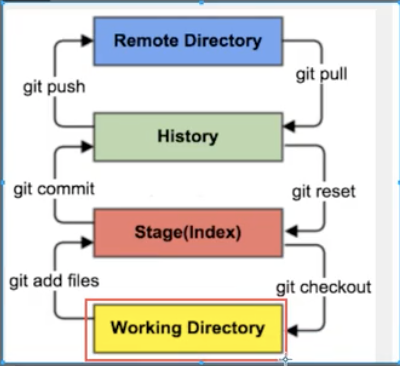

# **Git**

## **版本控制**

> 版本控制 版本迭代

版本控制就是一种在开发中用于管理我们对文件、目录或者工程等内容的修改历史，方便查看更改历史记录，备份可以恢复以前版本的软件工程技术

* 实现跨区域多人协同开发
* 并行开发、提高开发效率
* 追踪和记录一个或者多个文档的历史记录

简单的说，用于管理多人协同开发项目的技术

> 常见的版本控制技术

* Git
* SVN（subversion）
* CVS
* VSS
* TFS

>版本控制分类

## 1. 本地版本控制

记录文件的每次更新，可以对每个版本做一个快照，或者记录补丁文件，适合个人用，如RCS

## 2. 集中版本控制

所有的版本数据都保存在服务器上，协同开发者从服务器上同步更新或上传自己的修改

所有版本数据都存储到服务器上，用户的本地只有自己以前同步的版本，如果不联网的时候，用户看不到历史版本，也无法切换版本验证问题，或者在不同分支工作。如果这个服务器崩了，那么就会出现问题。比如SVN

## 3. 分布式版本控制 （Git）

所有的版本都同步到本地的每个用户，可以在本地查看所有的版本历史，可以离线在本地提交，然后在联网的时候push到相应的服务器或者其他用户，由于所有的用户都保存着所有的版本数据，只要有一个用户的设备没有问题，那么就可以恢复到所有的数据，但是增加了本地存储空间的占用

> Git和SVN的区别

SVN是集中式版本控制系统，版本库是集中放在服务器的，工作的时候，需要从中央服务器得到最新的版本，然后工作，然后提交到中央服务器，必须链接网络才能工作

Git是分布式版本控制系统，没有中央服务器，每个人的电脑都是一个完整的版本库，工作的时候不需要联网。协同的办法：如果你修改了文件A，另一个人修改了文件B，那么你们只需要把各自的修改推送给对方，就可以看到对方的修改了

## **Git的配置**

查看配置  git config -l

查看系统配置  git config --system --list

查看全局配置  git config --global --list

>设置用户名和邮箱

当你安装完Git之后，首先要做的是设置你的用户名和e-mail地址

> git config --global user.namne "dujaingzheng" # name  
git config --global user.email du-william@outlook.com # email

## **Git的工作原理**

>工作区域

Git本地有三个工作区域，工作目录working directory， 暂存区（stage/index），资源库（Repository 或者Git directory），加上remote directory 就可以分成四个区域



## 本地仓库搭建

> 初始化

` git init `

> clone一个远程仓库

``` bash
# 克隆一个项目和她的整个代码历史
$ git clone [url]
```

## **Git文件操作**

>文件的四种状态

版本控制就是对文件的版本控制，对文件进行修改、提交等操作，首先知道文件的状态

* **Untracked** ： 未跟踪 ，此文件在文件夹中，没有加入git库中，不参与版本控制，通过git add 状态变成staged
* **Unmodify** ： 文件已经入库，但是未修改，即版本库中的文件快照内容和文件夹中完全一致，这种类型的文件有两种去处，如果被修改了，那么就是modified，如果使用git rm移除版本库，就会变成untracked文件
* **Modifyed** ：文件已经被修改，一般使用git add 进入暂存staged状态，使用git checkout则丢弃修改过，返回unmodify,这个git checkout就是从库中取出文件，覆盖当前修改
* **Staged** ：暂存状态，执行git commit 则将修改同步到库中，此时库的文件和本地文件变成一致，文件为unmodify。状态执行git reset HEAD fielname 则取消暂存，文件状态为Modified

查看git的状态
`$ git status`

>忽略文件

有的时候我们不想把某些文件放到版本控制中，在主目录下简历“.gitignore“文件

1. 忽略文件中的空行或者用（#）开始的行会被忽略
2. 可以使用Linux的通配符
3. 如果名称最前面有一个感叹号（！），表示例外规则，则不会被ignore
4. 如果名称最前面是一个路径分割符号（/），则表示要忽略的文件在此目录下，而子目录中的文件不忽略
5. 如果名称的最后是一个路径分隔符（/），表示要忽略的是此目录下该名称的子目录，而非文件（默认文件或者目录都被忽略）

``` bash
#是注释
*.txt # 忽略所有的txt文件
！lib.txt # 这个txt文件除外
/temp # 仅忽略项目根目录下的temp文件
build/  #忽略build目录下的所有文件
doc/*.txt  #忽略doc下的txt
```

## **Git分支**

常用的分支命令

``` bash

# 列出所有本地分支
    $ git branch

    # 列出所有远程分支
    $ git branch -r

    # 列出所有本地分支和远程分支
    $ git branch -a

    # 新建一个分支，但依然停留在当前分支
    $ git branch [branch-name]

    # 新建一个分支，并切换到该分支
    $ git checkout -b [branch]

    # 新建一个分支，指向指定commit
    $ git branch [branch] [commit]

    # 新建一个分支，与指定的远程分支建立追踪关系
    $ git branch --track [branch] [remote-branch]

    # 切换到指定分支，并更新工作区
    $ git checkout [branch-name]

    # 切换到上一个分支
    $ git checkout -

    # 建立追踪关系，在现有分支与指定的远程分支之间
    $ git branch --set-upstream [branch] [remote-branch]

    # 合并指定分支到当前分支
    $ git merge [branch]

    # 选择一个commit，合并进当前分支
    $ git cherry-pick [commit]

    # 删除分支
    $ git branch -d [branch-name]

    # 删除远程分支
    $ git push origin --delete [branch-name]
    $ git branch -dr [remote/branch]

```

如果冲突了就解决

如果多个分支并行执行，就会导致我们的的代码不冲突，也就是同时存在多个版本，解决的办法是我们可以修改冲突文件之后重新提交！选择要保留的别人的代码还是自己的代码

> 合并 ` git merge [branch] ` 合并指定分支到当前分支
